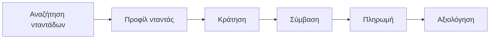

# Νταντάδες της γειτονιάς

[Τεκμηρίωση PDF](docs/neighborhood-nannies-handbook.pdf) · [HTML](docs/neighborhood-nannies-handbook.html)

Εφαρμογή React με Firebase (Auth, Firestore): γονείς και νταντάδες, αναζητήσεις, προφίλ, ραντεβού, συμβάσεις, πληρωμές, μηνύματα. Στυλ διεπαφής gov-style (`gov-theme.css`, `gov-pages.css`, `premium-shell.css`).

```bash
npm install
npm start
```

Παραγωγή: `npm run build` → φάκελος `build/`.


|          |                                    |
| -------- | ---------------------------------- |
| UI       | React 19                           |
| Router   | React Router 6                     |
| Δεδομένα | Firebase Auth + Firestore          |
| Build    | Create React App (`react-scripts`) |


Ρυθμίσεις Firebase: `src/firebase.js`. Διαδρομές σελίδων: `src/App.js`, `src/contexts/AuthContext.js`.

## Ροή σελίδων

`PrivateRoute` στο `App.js` όπου απαιτείται συνδεδεμένος χρήστης· οι υπόλοιπες διαδρομές στο σχήμα.

```mermaid
%%{init: {'flowchart': {'nodeSpacing': 72, 'rankSpacing': 72, 'padding': 24, 'useMaxWidth': false}, 'themeVariables': {'fontSize': '18px'}}}%%
flowchart TB
  subgraph pub["Χωρίς υποχρεωτική σύνδεση"]
    HOME["/ — Αρχική"]
    LOGIN["/login"]
    REG["/register"]
    RESET["/reset-password"]
    ELI["/eligibility"]
    HOW["/how-it-works"]
    FAQ["/faq"]
    ABOUT["/about-us"]
    HELP["/help"]
    OB_P["/onboarding-parent"]
    OB_N["/onboarding-nanny"]
  end

  subgraph aut["Με σύνδεση"]
    PD["/parent-dashboard"]
    ND["/nanny-dashboard"]
    ADM["/admin-dashboard"]
    SN["/search-nannies"]
    SP["/search-parents"]
    NP["/nanny/:id"]
    FP["/nanny/:id/full-profile"]
    PP["/parent/:id"]
    BK["/booking/:nannyId"]
    CT["/contract/:nannyId"]
    PAY["/payment/:nannyId"]
    RV["/review/:nannyId"]
    RVD["/review/:id/details"]
    ENP["/edit-nanny-profile"]
    EP["/edit-profile"]
    CAD["/create-ad"]
    MADS["/nanny/manage-ads"]
    MAP["/manage-appointments"]
    SCH["/schedule"]
    CV["/completed-vouchers"]
    VH["/history"]
    VOU["/vouchers"]
    PH["/payment-history"]
    NV["/nanny-vouchers"]
    NH["/nanny-history"]
    NOT["/notifications"]
    IN["/messages/inbox"]
    OUT["/messages/outbox"]
    CH["/chat/:id"]
    ULD["/upload-legal-doc"]
    ADV["/search/advanced"]
    CD["/contracts/:id/details"]
    SET["/settings"]
  end

  HOME --> LOGIN
  HOME --> REG
  LOGIN --> PD
  LOGIN --> ND
  SN --> NP
  NP --> FP
  NP --> BK
  BK --> CT
  CT --> PAY
  PAY --> RV
  RV --> RVD
  IN --> CH
  OUT --> CH
```






## Names 
karterisg <br>
Cholevasd
